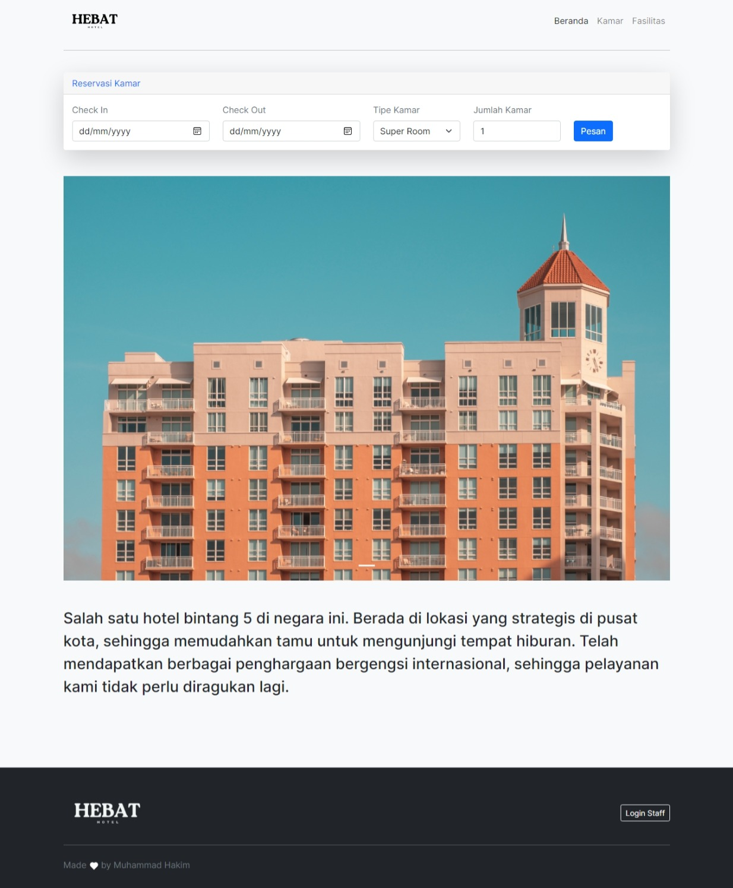

# Tentang Aplikasi

*Homepage Guest*

*Admin Dashboard*

*Receptionist Dashboard*

------------  

Aplikasi ini merupakan hasil dari Ujian Kompetensi saat saya SMK. Aplikasi ini digunakan untuk memesan kamar hotel. 

Sebagai tamu, bisa memesan kamar. Sebagai admin bisa menambah-mengubah-menghapus kamar, fasilitas kamar dan fasilitas hotel. Sebagai resepsionis bisa memeriksa data pemesanan.

**Tech Stack :**
+ Codeigniter 3
+ Bootstrap 5
+ Mysql

**Learning Outcome :**
+ Mysql Store Procedure
+ Mysql View
+ Exploring Bootstrap
+ Clean Code
+ Exploring Codeigniter 3

# Cara Menggunakan Aplikasi

### Tahap 1 Instalasi :
1. Instal Xampp atau sejenisnya.
2. Clone / Download project ini, lalu simpan di htdocs local.

### Tahap 2 Konfigurasi :
1. Buat database, lalu import database dengan database `db_reservasi_hotel`.
2. Buka folder `application/config/database`, lalu ubah `database` sesuai nama database kalian.
3. Buka folder `application/config/config`, lalu ubah `base_url` sesuai dengan url kalian.

### Tahap 3 Konfigurasi Fitur Send Email
1. Buka folder `application/controller/reservasi` cari method `send_email`, lalu ubah `stmp_user` dan `stmp_pass` dengan email dan password email kalian.

### Tahap 4 jalankan Aplikasi
1. ketik `http://localhost/nama-project/` pada browser kalian.